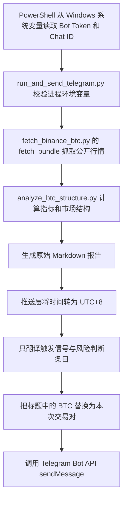

# 市场结构扫描程序使用说明与执行逻辑

## 1. 功能概览

程序从 Binance USDⓈ-M Futures 公共 API 读取指定合约的市场数据，计算 15 分钟、1 小时和 4 小时结构指标，生成市场结构报告，并可通过 Telegram Bot 推送。行情读取不需要 Binance API Key；Telegram 推送需要配置 `TELEGRAM_BOT_TOKEN` 和 `TELEGRAM_CHAT_ID`。

程序只生成风险提示和观察建议，不下单，也不提供必须买入或卖出的指令。

## 2. 文件职责

| 文件 | 用途 |
| --- | --- |
| `scripts/fetch_binance_btc.py` | 从 Binance 公共接口抓取行情并保存 JSON 数据包。 |
| `scripts/analyze_btc_structure.py` | 计算指标、归类市场结构并生成 JSON 或 Markdown 报告。 |
| `scripts/run_and_send_telegram.py` | 完成扫描、分析、报告格式处理和 Telegram 推送。 |
| `SKILL.md` | 项目的使用范围、周期、风险和输出规范。 |

## 3. Telegram 环境变量

推送脚本从 Python 进程环境读取以下变量：

- `TELEGRAM_BOT_TOKEN`：Telegram Bot Token。
- `TELEGRAM_CHAT_ID`：目标频道 ID 或 `@频道用户名`。

目前这两个变量配置在 Windows **系统变量**中。不要把变量值写进脚本、任务参数、命令行文本或日志。可以只检查是否可读，不显示值：

```powershell
$names = 'TELEGRAM_BOT_TOKEN', 'TELEGRAM_CHAT_ID'
foreach ($name in $names) {
    [pscustomobject]@{
        Name = $name
        SystemVariableReadable = [bool][Environment]::GetEnvironmentVariable($name, 'Machine')
        ProcessVariableReadable = [bool][Environment]::GetEnvironmentVariable($name, 'Process')
    }
}
```

如果系统变量刚刚变更，已打开的 PowerShell、计划任务服务或 Codex 进程可能还保留旧环境块。手动命令可以从系统变量重新装入当前 PowerShell 进程；计划任务需要在 Windows 已刷新系统环境后启动。

## 4. 完整扫描与推送

在 PowerShell 中执行以下命令。可把 `BTCUSDT` 换成 Binance USDⓈ-M Futures 支持的交易对：

```powershell
$ErrorActionPreference = 'Stop'
$env:TELEGRAM_BOT_TOKEN = [Environment]::GetEnvironmentVariable('TELEGRAM_BOT_TOKEN', 'Machine')
$env:TELEGRAM_CHAT_ID = [Environment]::GetEnvironmentVariable('TELEGRAM_CHAT_ID', 'Machine')
if (-not $env:TELEGRAM_BOT_TOKEN -or -not $env:TELEGRAM_CHAT_ID) {
    throw '系统环境变量 TELEGRAM_BOT_TOKEN 或 TELEGRAM_CHAT_ID 不可读。'
}
$env:PYTHONIOENCODING = 'utf-8'
& 'D:\Python\Python314\python.exe' `
  'L:\Skill\BTC-Trade-Skill\scripts\run_and_send_telegram.py' `
  --symbol BTCUSDT
```

常用参数：

```text
--symbol BTCUSDT       交易对；省略时默认 BTCUSDT
--kline-limit 1000    每个周期抓取的 K 线数量；默认 1000，Binance 上限 1500
--market-limit 96      衍生品统计接口的历史记录数；默认 96
```

例如完整扫描并推送 ETHUSDT：

```powershell
& 'D:\Python\Python314\python.exe' `
  'L:\Skill\BTC-Trade-Skill\scripts\run_and_send_telegram.py' `
  --symbol ETHUSDT
```

## 5. 只抓取和分析，不推送

```powershell
& 'D:\Python\Python314\python.exe' `
  'L:\Skill\BTC-Trade-Skill\scripts\fetch_binance_btc.py' `
  --symbol BTCUSDT `
  --out 'L:\Skill\BTC-Trade-Skill\btc_market.json'

$env:PYTHONIOENCODING = 'utf-8'
& 'D:\Python\Python314\python.exe' `
  'L:\Skill\BTC-Trade-Skill\scripts\analyze_btc_structure.py' `
  --input 'L:\Skill\BTC-Trade-Skill\btc_market.json' `
  --format markdown
```

`--format` 可用 `markdown` 或 `json`。独立运行分析脚本时，报告时间沿用抓取数据里的 UTC 字符串；Telegram 包装脚本会把报告的“数据更新时间”转换为 UTC+8 并加上 `UTC+8` 标记。

## 6. 完整执行链



实际顺序如下：

1. PowerShell 把系统作用域中的 Telegram 参数装入当前进程环境；Python 脚本本身只读取进程环境。
2. 推送脚本检查两个变量是否存在。缺少任一变量时返回退出码 `2`，不启动抓取和推送。
3. 抓取器读取 15m、1h、4h K 线、当前未平仓量、未平仓量历史、主动买卖比、多空账户/持仓比、资金费率历史及标记价/指数价等数据。
4. 分析器计算涨跌幅、成交量比、支撑/压力、持仓量变化、资金费率分位与 Z 分数、主动买卖比等指标，并生成结构分类和风险提示。
5. Telegram 包装脚本只调整报告的三个部分：更新时间转 UTC+8、将“触发信号”和“风险判断”条目翻译为中文、把标题交易对替换为本次 `--symbol`。其他报告内容保持分析器原样。
6. 推送脚本通过 Telegram Bot API 发送文本消息，关闭网页预览；单条消息超过 4096 字符会报错。

## 7. 行情和分析逻辑

### 数据和指标

- K 线周期：15m、1h、4h；每个周期默认最多抓取 100 根。
- K 线统计要求至少 25 根；以最新价格和此前约 20 个周期计算 20 周期涨跌、成交量比及近期高低区间。
- 交易量比以最新 K 线量除以前 20 根 K 线平均量。
- 支撑/压力来自可用周期近 20 根 K 线的低点/高点；最终支撑取各周期低点最小值，压力取高点最大值。
- 资金费率侧计算当前费率、年化估算、近端分位/Z 分数、溢价基差，以及 1 天和 2 天持仓成本估算。
- 未平仓量、主动买卖比和多空比按 Binance 返回数据计算；部分历史统计接口不可用时，该组会被标为缺失。

### 关键阈值

- 1h 多头方向：20 个 1h 周期涨幅大于 `0.5%`；空头方向小于 `-0.5%`。
- 4h 多头方向：20 个 4h 周期涨幅大于 `1.0%`；空头方向小于 `-1.0%`。
- 放量：15m 或 1h 成交量比至少 `1.8`。
- 低量：15m 与 1h 可用成交量比均低于 `1.2`。
- 主动买入确认：主动买卖比至少 `1.2`；主动卖出确认：不高于 `0.8`。
- 资金费率极端：Z 分数至少 `2` 或近期分位至少 `90` 为正向极端；Z 分数不高于 `-2` 或分位不高于 `10` 为负向极端。
- 持仓量上升：指定历史窗口变化超过 `2%`；持仓量收缩：变化低于 `-3%`。
- 杠杆累积区间：4h 近 20 周期振幅低于 `3%`，且持仓量上升。

### 状态识别优先级

分析器按以下顺序匹配，命中前面的条件后不会继续匹配后续状态：

1. **放量突破**：价格突破 15m 或 1h 近期区间、放量、主动买入比确认、持仓量上升，且资金费率没有正向极端。
2. **放量破位**：价格跌破近期区间、放量、主动卖出比确认、持仓量上升，且资金费率没有负向极端。
3. **假突破风险**：发生上破，但成交量不足或主动买入未确认。
4. **多头拥挤上升**：1h/4h 同向上涨，正资金费率极端，且持仓量上升。
5. **空头拥挤下降**：1h/4h 同向下跌，负资金费率极端，且持仓量上升。
6. **清算释放后观察**：持仓量收缩且放量。
7. **杠杆区间累积**：4h 区间收窄且持仓量上升。
8. **健康上升/下降趋势**：1h 与 4h 同向，未触发更高优先级状态；放量可增加 1 分。
9. 其余情况按持仓量是否上升归为杠杆区间累积或数据不足。

若 OI、主动买卖、多空比、资金费率四组里缺少至少三组，或 1h K 线指标不可用，则强制分类为 `data_insufficient`。

### 评分、预警和动作

- 基础结构按规则累计 0–10 分；缺失确认组会扣分。
- `7–10`：high；`5–6`：medium；`3–4`：low；`0–2`：none。
- 数据不足时固定为 low、3 分，并建议观望。
- 分析器默认动作是“观望”。中/高预警下，拥挤或假突破结构会建议等待确认；突破/破位结构会要求开仓前检查；区间累积建议等待放量；清算释放建议等待二次确认。
- 健康上升/下降趋势本身不会产生开仓指令。

## 8. Telegram 报告格式

- 标题按交易对生成，例如 `ETHUSDT 市场结构扫描` 或 `ETHUSDT 市场结构预警`。
- “触发信号”和“风险判断”内的条目由推送层转换为中文；其余字段、结构标签和指标名称保持原模板内容。
- 数据更新时间在推送前按 UTC+8 转换，并显示 `UTC+8`。
- 数据来源字段由分析报告提供，通常为 `Binance public API`。

## 9. 定时任务

当前计划任务名为 `BTCUSDT-Telegram-Market-Analysis`，默认使用 `BTCUSDT`，每 4 小时运行一次；仅在 `CA19002\lujie` 用户登录时运行，错过时间后可在登录时补跑一次，若上次扫描仍运行则忽略新实例。任务通过 PowerShell 启动 Python 推送脚本，工作目录为 `L:\Skill\BTC-Trade-Skill`。

计划任务重复触发持续时间设置为 3650 天；该时段结束后需重新注册/更新任务。查看任务状态：

```powershell
Get-ScheduledTask -TaskName 'BTCUSDT-Telegram-Market-Analysis'
Get-ScheduledTaskInfo -TaskName 'BTCUSDT-Telegram-Market-Analysis'
```

## 10. 退出状态和限制

| 退出码 | 含义 |
| --- | --- |
| `0` | Telegram API 接受了推送消息。 |
| `1` | 抓取/报告处理/Telegram 发送过程中发生运行错误，或 Telegram 拒绝消息。 |
| `2` | 缺少 `TELEGRAM_BOT_TOKEN` 或 `TELEGRAM_CHAT_ID`。 |

抓取器会把单个 Binance API 失败记录到数据包，不一定中止整个程序；如果关键数据缺失，分析结果会标为数据不足。当前推送脚本没有额外的交易对预检，因此运行前应确认交易对属于 Binance USDⓈ-M Futures。报告不是自动交易信号，也不会发送订单。
